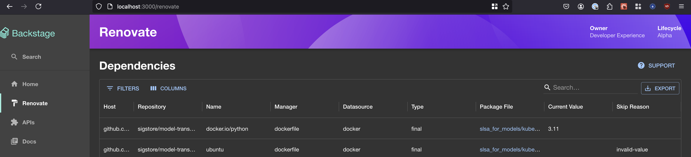

# renovate

This plugin provides the UI for the @backstage/renovate-backend plugin to display the reports generated and dependencies extracted by Renovate.

The main features provided by this plugin currently are:

- A utility to run Renovate against repositories to extract reports.
- A central overview for all reports with the option to inspect and reschedule them.
- A data grid to display all dependencies extracted by Renovate.
- A entity page to display dependencies for a specific component.

## Getting started

For this plugin to work, you need to have the [@backstage/renovate-backend](../renovate-backend) plugin installed and configured.

Install the plugin:

```bash
# Install packages from the root directory
yarn --cwd packages/app add @secustor/backstage-plugin-renovate
```

### New Frontend System

Add the plugin to your Backstage instance:

```tsx
// Add the following to `packages/app/src/App.tsx`
import renovatePlugin from '@secustor/backstage-plugin-renovate/alpha';

export default createApp({
  features: [
    // Your other features
    renovatePlugin,
  ],
});
```

Configure the plugin in your `app-config.yaml`:

```yaml
app:
  extensions:
    - page:renovate:
        config:
          showStarter: true # Optional: Show the starter configuration helper
```

### Old Frontend System

Add the plugin to your Backstage instance:

```tsx
// Add the following to `packages/app/src/App.tsx`
import { RenovatePage } from '@secustor/backstage-plugin-renovate';

const routes = (
  <FlatRoutes>
    {/* Your other routes */}
    <Route path="/renovate" element={<RenovatePage showStarter />} />
  </FlatRoutes>
);
```

```tsx
// Add the following to `packages/app/src/components/catalog/EntityPage.tsx`
import { EntityRenovateContent } from '@secustor/backstage-plugin-renovate';

const defaultEntityPage = (
  <EntityLayout>
    {/* Existing entity content */}
    <EntityLayout.Route path="/renovate" title="Renovate">
      <EntityRenovateContent />
    </EntityLayout.Route>
  </EntityLayout>
);
```

## Screenshots




## Demos

- [Extract Dependency Data on Scale with Renovate - Open Source Summit Europe 2024](https://youtu.be/dWuAn0x-yAk?t=1568)
